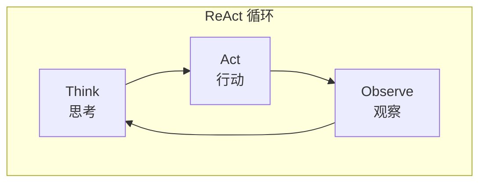

# NanoAgent

一个轻量级的 AI Agent 框架，实现 ReAct (Reasoning + Acting) 模式，专为学习和实验设计。

**[使用教程](docs/tutorial.md)** | **[API 文档](docs/api.md)** | **[开发路线图](ROADMAP.md)**

## 项目简介

NanoAgent 是一个简洁易懂的 AI Agent 框架，通过实现经典的 ReAct 模式，让 AI 能够进行推理和行动的循环交互。项目支持 Ollama 本地 LLM 和 OpenAI 兼容的在线 API（OpenAI、DeepSeek、Moonshot 等），灵活适配不同使用场景。

### 核心特性

- **ReAct 模式**: 实现 Think → Act → Observe 推理循环
- **工具调用**: 支持多种内置工具（文件操作、Shell 命令、Python 执行、网络搜索）
- **多 LLM 支持**: 支持 Ollama 本地模型和 OpenAI 兼容 API（OpenAI、DeepSeek、Moonshot 等）
- **持久化记忆**: 支持会话保存和恢复，跨会话记忆
- **技能包机制**: 可扩展的技能包系统，支持热加载
- **运行监控**: Token 使用统计、上下文使用率、LLM 调用追踪
- **模块化设计**: 清晰的抽象层次，易于扩展
- **配置灵活**: YAML 配置文件，支持自定义模型和参数

## 核心原理

### ReAct 模式

ReAct (Reasoning + Acting) 是一种让大语言模型交替进行推理和行动的模式：



**工作流程**:

1. **Think (思考)**: LLM 分析当前任务，决定下一步行动
2. **Act (行动)**: 调用工具执行具体操作
3. **Observe (观察)**: 获取工具执行结果，更新上下文
4. **循环**: 根据观察结果继续思考，直到任务完成

### 架构设计

```
nano_agent/
├── agent/          # Agent 实现
│   ├── base.py     # 抽象基类
│   ├── react.py    # ReAct Agent
│   └── prompts.py  # 系统提示词
├── llm/            # LLM 客户端
│   ├── base.py     # 抽象接口
│   ├── ollama.py   # Ollama 实现
│   ├── openai_compatible.py # OpenAI 兼容 API
│   └── messages.py # 消息结构
├── memory/         # 对话记忆
├── tools/          # 工具系统
│   ├── base.py     # 工具基类和注册表
│   ├── file_ops.py # 文件操作
│   ├── shell.py    # Shell 命令
│   └── python_executor.py # Python 执行
├── config/         # 配置管理
└── cli/            # 命令行接口
```

## 技术依赖

### 运行时依赖

- **Python**: >= 3.10
- **requests**: >= 2.28.0 (HTTP 请求)
- **PyYAML**: >= 6.0 (配置解析)

### 外部依赖

- **Ollama** (可选): 本地 LLM 服务
  - 安装: https://ollama.ai
  - 默认地址: `http://localhost:11434`
  - 推荐模型: `qwen2.5`, `llama3`, `mistral`

- **在线 API** (可选): OpenAI 兼容的 API 服务
  - OpenAI: https://platform.openai.com
  - DeepSeek: https://platform.deepseek.com
  - Moonshot: https://platform.moonshot.cn

### 开发依赖

```bash
pip install -e ".[dev]"
```

- **pytest**: >= 7.0.0 (测试框架)
- **black**: >= 23.0.0 (代码格式化)

## 安装

### 1. 安装 Ollama

```bash
# macOS/Linux
curl -fsSL https://ollama.com/install.sh | sh

# 拉取模型
ollama pull qwen2.5:7b
```

### 2. 安装 NanoAgent

```bash
# 克隆项目
git clone <repository-url>
cd NanoAgent

# 安装依赖
pip install -e ".[dev]"
```

## 使用示例

### 命令行使用

```bash
# 交互模式
nano-agent

# 指定模型
nano-agent -m llama3

# 使用自定义配置
nano-agent -c config/config.yaml

# 非交互模式（从 stdin 读取）
echo "帮我列出当前目录的文件" | nano-agent --non-interactive

# 安静模式（减少输出）
nano-agent -q
```

### 代码中使用

```python
from nano_agent.llm import create_llm
from nano_agent.memory.short_term import ShortTermMemory
from nano_agent.agent.react import ReActAgent
from nano_agent.tools.builtin import create_default_tool_registry

# 使用 Ollama 本地模型
llm = create_llm(provider="ollama", model="qwen2.5:7b")

# 或使用在线 API
# llm = create_llm(provider="deepseek", api_key="your-api-key")

memory = ShortTermMemory()
tools = create_default_tool_registry()

# 创建 Agent
agent = ReActAgent(
    llm=llm,
    memory=memory,
    tool_registry=tools,
    max_iterations=10,
    verbose=True
)

# 运行
response = agent.run("帮我创建一个 hello.txt 文件，内容是 'Hello World'")
print(response)
```

### 自定义工具

```python
from nano_agent.tools.base import BaseTool, ToolResult

class MyCustomTool(BaseTool):
    name = "my_tool"
    description = "我的自定义工具"
    parameters_schema = {
        "type": "object",
        "properties": {
            "input": {
                "type": "string",
                "description": "输入参数"
            }
        },
        "required": ["input"]
    }

    def execute(self, input: str) -> ToolResult:
        # 实现工具逻辑
        result = f"处理结果: {input}"
        return ToolResult(success=True, output=result)

# 注册工具
tools.register(MyCustomTool())
```

## 配置说明

编辑 `config/config.yaml`:

```yaml
# LLM 设置
llm:
  provider: ollama           # ollama / openai / deepseek / moonshot / openai_compatible
  model: qwen2.5:7b          # 使用的模型
  base_url: http://localhost:11434
  timeout: 120
  temperature: 0.7
  # api_key: xxx             # 直接配置 API Key（不推荐）
  # api_key_env: OPENAI_API_KEY  # 环境变量名（推荐）

# Agent 设置
agent:
  max_iterations: 10         # 最大推理轮数
  verbose: true              # 显示详细过程

# 记忆设置
memory:
  type: short_term
  max_messages: 50           # 最大消息数

# 工具设置
tools:
  enabled: [all]             # 启用的工具
  disabled: []               # 禁用的工具
```

### 使用在线 API

1. 设置环境变量：

```bash
# OpenAI
export OPENAI_API_KEY="sk-..."

# DeepSeek
export DEEPSEEK_API_KEY="sk-..."

# Moonshot
export MOONSHOT_API_KEY="sk-..."
```

2. 修改配置文件：

```yaml
# 使用 DeepSeek
llm:
  provider: deepseek
  model: deepseek-chat

# 使用自定义 OpenAI 兼容 API
llm:
  provider: openai_compatible
  model: custom-model
  base_url: https://your-api.example.com/v1
  api_key_env: CUSTOM_API_KEY
```

## 内置工具

| 工具名称 | 功能描述 |
|---------|---------|
| `python_execute` | 执行 Python 代码 |
| `file_read` | 读取文件内容 |
| `file_write` | 写入文件 |
| `file_search` | 搜索文件（glob 模式） |
| `shell_execute` | 执行 Shell 命令 |
| `web_search` | 网络搜索（使用 Bing） |
| `memorize` | 存储信息到长期记忆 |
| `recall` | 从长期记忆检索信息 |
| `list_memories` | 列出所有长期记忆 |
| `forget` | 删除长期记忆条目 |
| `get_stats` | 获取运行统计信息 |

## 运行监控

NanoAgent 提供运行时监控功能，帮助了解 Agent 运行状态：

```
📊 本轮:   1500 tokens |   2.50s | LLM调用:   2 | 迭代: 2 | 工具: ✓web_search
📊 总计:  15000 tokens |  45.20s | LLM调用:  12 | 上下文: 11.7% (15000/128000)
```

- **Token 统计**: 显示本轮和会话总计的 token 消耗
- **LLM 调用**: 统计 API 调用次数（计费相关）
- **上下文使用率**: 显示当前上下文占用量，超过 80% 时警告
- **工具调用追踪**: 显示每个工具调用的状态和耗时

## 会话管理

```bash
# 列出所有会话
nano-agent --list-sessions

# 恢复会话
nano-agent --resume session_abc123

# 开始新会话
nano-agent --new-session

# 查看会话内容
nano-agent --show-session session_abc123
```

## 开发

```bash
# 运行测试
pytest tests/ -v

# 测试覆盖率
python tests/run_tests.py --coverage

# 代码格式化
black .
```

## 许可证

MIT License
