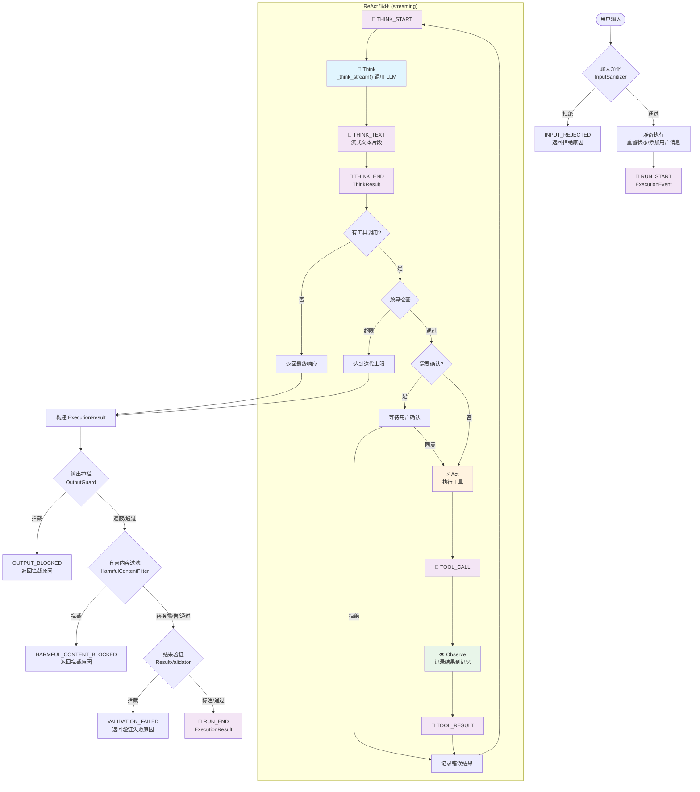
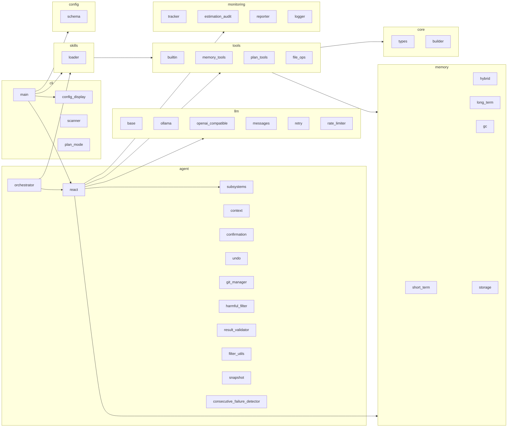

# NanoAgent 架构文档

本文档描述 NanoAgent 的系统架构，包括分层结构、核心组件和数据流。

## 1. 分层架构

```mermaid
graph TB
    subgraph CLI["CLI 层"]
        MAIN[main.py<br/>交互式入口]
        CONSOLE[console.py<br/>控制台工具]
        SCANNER[scanner.py<br/>项目扫描]
        PLAN[plan_mode.py<br/>计划模式]
    end

    subgraph Agent["Agent 层"]
        ORCH[AgentOrchestrator<br/>编排层]
        REACT[ReActAgent<br/>执行层]
        CTX[ContextManager<br/>上下文管理]
        CONFIRM[ConfirmationManager<br/>确认机制]
        UNDO[UndoStack<br/>撤销栈]
        GIT[GitManager<br/>Git集成]
        STALL[StallDetector<br/>停滞检测]
        CACHE[ToolResultCache<br/>多轮缓存]
        OFFLOAD[ToolOffloadManager<br/>结果卸载]
        AUDIT[EstimationAudit<br/>估算审计]
        SEMANTIC[SemanticCompressor<br/>语义压缩]
        RETRY[RetryHandler<br/>重试处理]
        RL[RateLimiter<br/>速率限制]
        CB[CircuitBreaker<br/>熔断降级]
        SAN[InputSanitizer<br/>输入净化]
        GUARD[OutputGuard<br/>输出护栏]
        HFILTER[HarmfulContentFilter<br/>有害内容过滤]
        RVALIDATOR[ResultValidator<br/>结果验证]
        TTIMEOUT[ToolTimeoutWrapper<br/>工具超时]
        TRATE[ToolRateLimiter<br/>工具频率限制]
        SNAPMGR[SnapshotManager<br/>状态快照]
        CFD[ConsecutiveFailureDetector<br/>连续失败检测]
        FILTUTIL[filter_utils<br/>过滤共享工具]
    end

    subgraph Core["核心组件"]
        LLM[LLM Client<br/>Ollama/OpenAI]
        MEM[Memory<br/>ShortTerm/Hybrid/LongTerm]
        TOOLS[ToolRegistry<br/>工具注册表]
        SKILLS[SkillRegistry<br/>技能注册表]
        CORETYPES[core/types<br/>共享类型 RiskLevel]
        BUILDER[core/builder<br/>Agent Builder]
    end

    subgraph Storage["存储层"]
        FILE[FileStorage<br/>文件存储]
        SQLITE[SQLiteStorage<br/>数据库存储]
    end

    subgraph Monitoring["监控层"]
        TRACKER[MetricsTracker<br/>指标追踪]
        REPORTER[ReportGenerator<br/>报告生成]
        AUDIT[EstimationAudit<br/>估算审计]
    end

    MAIN --> ORCH
    MAIN --> SCANNER
    MAIN --> PLAN
    ORCH --> REACT
    ORCH --> SAN
    REACT --> SUB
    SUB --> CTX
    REACT --> CONFIRM
    REACT --> UNDO
    REACT --> GIT
    REACT --> STALL
    REACT --> CACHE
    REACT --> OFFLOAD
    REACT --> SEMANTIC
    REACT --> RL
    REACT --> RETRY
    REACT --> CB
    REACT --> TTIMEOUT
    REACT --> TRATE
    ORCH --> SNAPMGR
    ORCH --> CFD

    REACT --> LLM
    REACT --> MEM
    REACT --> TOOLS
    ORCH --> SKILLS

    MEM --> FILE
    MEM --> SQLITE

    REACT --> TRACKER
    TRACKER --> REPORTER
    TRACKER --> AUDIT
```



### 层级说明

| 层级 | 职责 | 主要组件 |
|------|------|----------|
| **CLI 层** | 用户交互、命令解析、会话管理 | `main.py`, `scanner.py`, `plan_mode.py` |
| **Agent 层** | 推理执行、上下文管理、撤销机制 | `ReActAgent`, `AgentOrchestrator`, `AgentSubsystems`（门面）, `ContextManager`, `StallDetector`, `ToolResultCache`, `ToolOffloadManager`, `SemanticCompressor`, `RateLimiter`, `RetryHandler`, `CircuitBreaker`, `InputSanitizer`, `OutputGuard`, `HarmfulContentFilter`, `ResultValidator`, `ToolTimeoutWrapper`, `ToolRateLimiter`, `SnapshotManager`, `ConsecutiveFailureDetector`, `filter_utils` |
| **核心组件** | LLM 调用、记忆管理、工具/技能注册、共享类型 | `BaseLLM`, `BaseMemory`, `ToolRegistry`, `SkillRegistry`, `core/types`（`RiskLevel`, `Plan`）, `core/builder`（`AgentBuilder`） |
| **存储层** | 持久化存储 | `FileStorage`, `SQLiteStorage` |
| **监控层** | 执行追踪、报告生成、估算审计 | `MetricsTracker`, `ReportGenerator`, `EstimationAudit` |

---

## 2. 核心类继承关系

```mermaid
classDiagram
    class BaseAgent {
        <<abstract>>
        +llm: BaseLLM
        +memory: BaseMemory
        +tool_registry: ToolRegistry
        +max_iterations: int
        +run(user_input: str) str
        +execute_tool(name, args) ToolResult
        +reset()
    }

    class ReActAgent {
        +tracker: MetricsTracker
        +events: EventEmitter
        +budget_checker: BudgetChecker
        +_subsystems: AgentSubsystems
        +_undo_stack: UndoStack
        +run(user_input) ExecutionResult
        +run_stream(user_input) ExecutionHandle
        +run_async(user_input) ExecutionResult
        +run_stream_async(user_input) AsyncExecutionHandle
        +_think() ThinkResult
        +_think_stream() Generator
        +_think_stream_async() AsyncGenerator
        +_act(tool_call) ToolResult
        +_observe(tool_call, result)
        +_try_routing(user_input) tuple
        +_try_prejudgment(user_input, routing_result) ExecutionResult
        +_try_duplicate_skip(tool_call, dry_run) ToolResult
        +_confirm_tool_execution(tool_call) ToolResult
        +_try_rate_limit(tool_call) ToolResult
        +undo_current_round()
    }

    class BaseLLM {
        <<abstract>>
        +model: str
        +base_url: str
        +chat(messages, tools) tuple
        +chat_stream(messages, tools) Generator
        +chat_stream_async(messages, tools) AsyncGenerator[StreamChunk]
        +_chat_stream_async_impl(messages, tools) AsyncGenerator[StreamChunk]
    }

    class OllamaLLM {
        +chat() tuple
        +chat_stream() Generator
        +chat_stream_async() AsyncGenerator[StreamChunk]
    }

    class OpenAICompatibleLLM {
        +chat() tuple
        +chat_stream() Generator
        +chat_stream_async() AsyncGenerator[StreamChunk]
    }

    class BaseMemory {
        <<abstract>>
        +add(message)
        +get_all() list
        +clear()
        +get_context(max_items) list
    }

    class ShortTermMemory {
        +set_system_prompt(prompt)
        +add_user_message(msg)
        +add_assistant_message(msg, tool_calls)
        +add_tool_result(id, content)
    }

    class HybridMemory {
        +short_term: ShortTermMemory
        +long_term: LongTermMemory
        +auto_compress: bool
    }

    class LongTermMemory {
        +storage: BaseStorage
        +importance_threshold: float
        +memorize(content, importance)
        +recall(query) list
        +delete_batch(ids) int
    }

    class MemoryGC {
        +config: MemoryGCConfig
        +run(ltm) GCResult
    }

    class BaseTool {
        <<abstract>>
        +name: str
        +description: str
        +risk_level: RiskLevel
        +parameters_schema: dict
        +execute(**kwargs) ToolResult
        +undo(undo_data, context) bool
    }

    class ToolRegistry {
        +_tools: dict
        +register(tool)
        +get(name) BaseTool
        +get_all_schemas() list
    }

    class SnapshotManager {
        +_config: SnapshotConfig
        +_events: EventEmitter
        +save(agent, orchestrator, name) SnapshotMetadata
        +restore(snapshot_id, agent, orchestrator) bool
        +list_snapshots() list
        +delete(snapshot_id) bool
        +maybe_auto_snapshot(agent, orchestrator) None
        +list_audit_entries(limit) list
        +rollback_from_audit(audit_id, agent, orchestrator) bool
        +attempt_auto_rollback(agent, orchestrator, failure_result) bool
    }

    class SnapshotMetadata {
        +snapshot_id: str
        +name: str
        +created_at: str
        +session_id: str
        +round_counter: int
        +message_count: int
        +total_tokens: int
        +version: str
    }

    class AuditLogEntry {
        +audit_id: str
        +operation: str
        +snapshot_id: str
        +timestamp: str
        +session_id: str
        +trigger: str
        +outcome: str
        +reason: str
        +round_counter: int
        +message_count: int
        +to_dict() dict
        +from_dict(data) AuditLogEntry
    }

    class ConsecutiveFailureDetector {
        +config: ConsecutiveFailureConfig
        +record_tool_result(tool_name, success, error) None
        +check() ConsecutiveFailureResult
        +reset() None
        +get_state() dict
        +set_state(state) None
    }

    class ConsecutiveFailureConfig {
        +enabled: bool
        +threshold: int
    }

    class ConsecutiveFailureResult {
        +triggered: bool
        +consecutive_failures: int
        +last_tool_name: str
        +last_error: str
    }

    class Snapshot {
        +metadata: SnapshotMetadata
        +orchestrator: dict
        +execution: dict
        +undo_stack: dict
        +tool_call_records: list
        +memory: dict
        +token_budget: dict
        +cache: dict
        +circuit_breaker: dict
        +duplicate_detector: dict
        +stall_detector: dict
        +feedback_loop: dict
        +tracker: dict
        +consecutive_failure_detector: dict
    }

    class AgentSubsystems {
        +token_budget: TokenBudget
        +query_router: QueryRouter
        +confidence_parser: ConfidenceParser
        +duplicate_detector: DuplicateDetector
        +stall_detector: StallDetector
        +cache: ToolResultCache
        +compressor: MessageCompressor
        +semantic_compressor: SemanticCompressor
        +offload_manager: ToolOffloadManager
        +output_simplifier: OutputSimplifier
        +confirmation: ConfirmationManager
        +context_manager: ContextManager
        +circuit_breaker: CircuitBreaker
        +result_validator: ResultValidator
        +feedback_loop: FeedbackLoop
        +timeout_wrapper: ToolTimeoutWrapper
        +rate_limiter: ToolRateLimiter
        +consecutive_failure_detector: ConsecutiveFailureDetector
        +from_configs() AgentSubsystems
        +from_defaults() AgentSubsystems
    }

    class RiskLevel {
        <<enum from core/types>>
        SAFE
        MODERATE
        DANGEROUS
    }

    BaseAgent <|-- ReActAgent
    BaseLLM <|-- OllamaLLM
    BaseLLM <|-- OpenAICompatibleLLM
    BaseMemory <|-- ShortTermMemory
    BaseMemory <|-- HybridMemory
    BaseMemory <|-- LongTermMemory

    ReActAgent --> BaseLLM
    ReActAgent --> BaseMemory
    ReActAgent --> ToolRegistry
    ReActAgent --> AgentSubsystems
    HybridMemory --> ShortTermMemory
    HybridMemory --> LongTermMemory
    HybridMemory --> MemoryGC

    SnapshotManager --> SnapshotMetadata
    SnapshotManager --> AuditLogEntry
    Snapshot --> SnapshotMetadata
    ConsecutiveFailureDetector --> ConsecutiveFailureConfig
    ConsecutiveFailureDetector --> ConsecutiveFailureResult
```



### 关键数据结构

```python
@dataclass
class ToolResult:
    """工具执行结果"""
    success: bool
    output: str
    error: str | None = None
    metadata: dict | None = None
    undo_data: dict | None = None

@dataclass
class ExecutionResult:
    """Agent 执行结果"""
    response: str
    success: bool
    iterations: int
    tool_calls: list[dict]
    tokens_used: int
    session_id: str
    termination_reason: str = "completed"

@dataclass
class LLMCallMetrics:
    """LLM 调用指标（新增字段用于 Token 消耗分析）"""
    timestamp: datetime
    model: str
    prompt_tokens: int
    completion_tokens: int
    total_tokens: int
    latency_ms: float
    tool_calls_count: int
    # Token 分类相关
    input_messages: list[dict]    # 输入消息列表
    output_text: str              # 输出文本
    tool_calls: list[dict]        # 工具调用列表
    tools_schema: list[dict]      # 工具定义 schema

class ExecutionEventType(str, Enum):
    """v0.9.0 流式执行事件类型"""
    RUN_START = "run_start"
    THINK_START = "think_start"
    THINK_TEXT = "think_text"
    THINK_END = "think_end"
    TOOL_CALL = "tool_call"
    TOOL_RESULT = "tool_result"
    GUARD_SHORT_CIRCUIT = "guard_short_circuit"
    RUN_END = "run_end"
    CANCELLED = "cancelled"

@dataclass
class ExecutionEvent:
    """v0.9.0 执行事件"""
    type: str                              # ExecutionEventType
    data: dict                             # 向后兼容数据
    text_chunk: str | None = None          # THINK_TEXT
    think_result: ThinkResult | None = None  # THINK_END
    tool_call: Any | None = None           # TOOL_CALL
    tool_result: Any | None = None         # TOOL_RESULT
    result: ExecutionResult | None = None  # RUN_END / GUARD_SHORT_CIRCUIT
    guard_name: str | None = None          # GUARD_SHORT_CIRCUIT

@dataclass
class ExecutionHandle:
    """v0.9.0 执行句柄"""
    events: Generator[ExecutionEvent, None, ExecutionResult]
    cancelled: bool = False

    def cancel(self):
        self.cancelled = True

@dataclass
class AsyncExecutionHandle:
    """v0.9.1 异步执行句柄"""
    events: AsyncGenerator[ExecutionEvent, None]
    cancelled: bool = False

    def cancel(self):
        self.cancelled = True

    async def collect_result(self) -> ExecutionResult | None: ...

@dataclass
class StreamChunk:
    """v0.9.1 异步流式块"""
    text: str = ""
    tool_call: ToolCall | None = None
    is_tool_call_complete: bool = False
    usage: LLMUsage | None = None
```

---

## 3. ReAct 循环数据流

v0.9.0 起，执行流程改为流式架构：CLI → `orchestrator.run_stream()` → `agent.run_stream()` → `_think_stream()` → `llm.chat()`。每个阶段产出 `ExecutionEvent` 对象，调用方可实时观察执行进展。`run()` 是 `run_stream()` 的薄封装，内部消费事件流并收集最终 `ExecutionResult`。

v0.9.1 新增异步流式路径（`streaming.mode="async"` 时启用）：CLI → `orchestrator.run_stream_async()` → `agent.run_stream_async()` → `_think_stream_async()` → `llm.chat_stream_async()`。`_think_stream_async()` 逐 `StreamChunk` 接收 LLM 输出，每个 `StreamChunk.text` 转换为 `THINK_TEXT` 事件，实现真正的逐 token 实时输出。



### 循环阶段说明

| 阶段 | 方法 | 事件类型 | 描述 |
|------|------|---------|------|
| **净化** | `InputSanitizer.sanitize()` | - | 编排层硬门控，格式检查→注入检查→长度检查 |
| **护栏** | `OutputGuard.guard()` | - | 编排层后门控，敏感检测→遮蔽/拦截/警告 |
| **有害过滤** | `HarmfulContentFilter.filter()` | - | 编排层第二道防线，有害内容检测→拦截/替换/警告 |
| **结果验证** | `ResultValidator.validate()` | - | 编排层第三道防线，验证声明正确性→拦截/警告/标注 |
| **Think Start** | `_think_stream()` 入口 | `THINK_START` | 上下文压缩、准备 LLM 调用 |
| **Think Text** | `llm.chat()` 流式输出 | `THINK_TEXT` | LLM 逐 token 生成文本片段 |
| **Think End** | `_think_stream()` 返回 | `THINK_END` | ThinkResult（文本 + 工具调用） |
| **Act** | `_act()` | `TOOL_CALL` | 执行工具，支持确认机制和撤销追踪 |
| **Observe** | `_observe()` | `TOOL_RESULT` | 将工具结果记录到记忆系统 |
| **Guard 短路** | `_try_routing()` / `_try_prejudgment()` 等 | `GUARD_SHORT_CIRCUIT` | Guard clause 提前终止，携带 guard 名称和结果 |
| **执行结束** | - | `RUN_END` | 携带最终 ExecutionResult |
| **取消** | `ExecutionHandle.cancel()` | `CANCELLED` | 用户主动取消执行 |

---

## 4. 模块依赖关系



---

## 5. 代码量统计

| 模块 | 代码行数 | 文件数 | 主要文件 |
|------|---------|--------|----------|
| **cli** | 3,766 | 7 | `main.py` (3348行) - 交互式CLI入口, `config_display.py` (418行) - 数据驱动配置渲染 |
| **agent** | 2,143 | 16 | `react.py` (1535行), `context.py` (440行), `subsystems.py` (297行), `filter_utils.py`, `git_manager.py` (295行) |
| **memory** | 1,996 | 13 | `sqlite_storage.py` (360行), `long_term.py` (458行), `hybrid.py` (292行), `gc.py` (138行) |
| **tools** | 1,972 | 11 | `memory_tools.py` (421行), `plan_tools.py` (355行), `file_ops.py` (318行) |
| **monitoring** | 999 | 7 | `tracker.py` (239行), `estimation_audit.py` (180行), `logger.py` (206行), `reporter.py` (205行) |
| **llm** | 694 | 5 | `openai_compatible.py` (192行), `ollama.py` (152行) |
| **config** | 339 | 3 | `schema.py` (188行), `loader.py` (150行) |
| **skills** | 334 | 3 | `loader.py` (189行), `base.py` (138行) |
| **utils** | 72 | 3 | `patterns.py` (43行) |
| **core** | 220 | 4 | `builder.py` (120行), `types.py` (59行) — 共享类型 (`RiskLevel`, `Plan`) 和 Agent Builder |

**总计**: 12,750 行 / 71 文件

---

## 6. 设计原则

### 用户干预控制

NanoAgent 采用"关键决策确认"模型，平衡用户控制与 LLM 自动化：

1. **审计透明**: 每次记忆操作后显示简要摘要
2. **一键撤销**: 用户可输入 `undo` 撤销最近操作
3. **无中断**: 正常流程持续进行，除非用户明确干预

```
[记忆] 存储用户名字: "王五" (importance: 0.8)
       输入 'undo' 撤销，或继续对话
```

### 抽象设计

- **BaseAgent/BaseLLM/BaseMemory/BaseTool**: 使用 ABC 定义抽象基类
- **Registry 模式**: `ToolRegistry` 和 `SkillRegistry` 集中管理扩展
- **策略模式**: 存储后端可插拔 (`FileStorage` / `SQLiteStorage`)
- **Facade 模式**: `AgentSubsystems` 门面将 20+ 子系统创建从 `ReActAgent.__init__` 中解耦，通过 `from_configs()` 工厂方法统一构建
- **Builder 模式**: `AgentBuilder`（`core/builder.py`）提供流式接口组装 `AgentOrchestrator`

### Guard Clause 模式

`ReActAgent` 采用 guard clause 模式，将长方法中的前置条件检查提取为独立方法，提前返回降低嵌套层级：

- **`_try_routing()`**: 规则路由，简单查询直接返回
- **`_try_prejudgment()`**: LLM 预判，默认 COMPLEX 时才触发
- **`_try_concise_simple()`**: 简洁模式问候语检测
- **`_try_budget_wrapup()`**: 预算收尾轮
- **`_try_budget_exhausted()`**: 预算耗尽强制总结
- **`_try_duplicate_skip()`**: 重复工具调用跳过
- **`_confirm_tool_execution()`**: 熔断/风险确认
- **`_try_rate_limit()`**: 工具频率限制

每个 guard 方法返回 `None` 表示继续，返回 `ExecutionResult`/`ToolResult` 表示提前终止。主流程仅用 `if result := guard(): return result` 一行处理。

### LLM 调用三层稳定性机制

`BaseLLM.chat()` 内置三层调用链，从主动预防到被动恢复逐层保护：

```
chat()                          ← 入口方法
  │
  ├─ ① RateLimiter.acquire()    ← 主动预防：令牌桶限流
  │     令牌以 requests_per_minute/60 速率填充
  │     桶容量 = burst，满时丢弃新令牌
  │     桶空时阻塞等待，避免触发 API 429
  │
  ├─ ② with_retry(_chat_impl)   ← 被动恢复：指数退避重试
  │     429/500/502/503/504/网络错误 → 自动重试
  │     400/401/403/ValueError → 立即抛出不重试
  │     延迟 = min(base × 2^attempt + jitter, max_delay)
  │
  └─ ③ _chat_impl()             ← 实际 API 调用（子类实现）
        OllamaLLM / OpenAICompatibleLLM 各自实现
```

**设计原则**：
- **预防优于治疗**: RateLimiter 主动控制调用频率，减少 429 错误发生概率
- **优雅降级**: 即使限流失败触发 429，RetryHandler 仍可自动恢复
- **透明分层**: 子类只需实现 `_chat_impl()`，无需关心限流和重试逻辑

### 输入净化门控

`AgentOrchestrator` 在 ReAct 循环前执行 `InputSanitizer`，是编排层边界的硬门控：

```
用户输入
  │
  └─ InputSanitizer.sanitize()
       │
       ├─ ① 格式检查：null 字节 → 拒绝，控制字符 → 剥离
       │
       ├─ ② PII 脱敏（可选）：phone/id_card/email/api_key → 遮蔽替换
       │
       ├─ ③ 注入检查：正则匹配 injection_patterns → 拒绝
       │
       ├─ ④ 长度检查：超长 → 截断或拒绝
       │
       └─ 通过 → 进入 ReAct 循环
```

**设计原则**：
- **格式先于注入**: 先清理格式问题（null 字节、控制字符），再检测注入模式，防止通过编码绕过注入检测
- **PII 先于注入**: PII 脱敏在注入检查前执行，遮蔽后的文本参与注入检测，确保遮蔽后的 PII 不会被误判为注入
- **注入零容忍**: 注入模式匹配始终拒绝，不可配置为截断
- **长度可配置**: `length_action` 支持 `truncate`（默认，保留输入）或 `reject`（严格模式）

### 输出护栏门控

`AgentOrchestrator` 在 ReAct 循环后执行 `OutputGuard`，是编排层边界的后门控——与输入净化器形成对称保护：

```
Agent 响应
  │
  └─ OutputGuard.guard()
       │
       ├─ ① PII 检测：phone/id_card/email/api_key → 遮蔽（复用 PIIDesensitizer）
       │
       ├─ ② 输出敏感检测：password/private_key/connection_string → 遮蔽或拦截
       │
       ├─ ③ 自定义模式检测：custom_patterns → 遮蔽或拦截
       │
       └─ 结果 → mask(遮蔽) / block(拦截) / warn(警告)
```

### 有害内容过滤门控

`AgentOrchestrator` 在 OutputGuard 之后执行 `HarmfulContentFilter`，是编排层边界的第二道防线——OutputGuard 防止信息*泄露*，HarmfulContentFilter 防止*有害内容*触达用户：

```
OutputGuard 通过的响应
  │
  └─ HarmfulContentFilter.filter()
       │
       ├─ ① 多类别检测：violence/hate/dangerous/illegal + custom_patterns
       │
       ├─ ② 优先级规则：block > replace > warn
       │
       ├─ ③ block → 整个响应被拦截（HARMFUL_CONTENT_BLOCKED）
       │
       ├─ ④ replace → 有害片段替换为 replacement_text
       │
       └─ ⑤ warn → 添加 [Content Warning: ...] 前缀
```

**设计原则**：
- **输入输出+有害内容三层防护**: 输入净化器保护"进来"的数据，输出护栏保护"出去"的数据不含敏感信息泄露，有害内容过滤器保护"出去"的数据不含危险内容
- **默认关闭**: 有害内容的定义因使用场景而异，用户需显式启用并选择检测类别
- **灵活动作**: 每个类别可独立配置 block/warn/replace，允许用户对低风险内容（如 illegal）仅警告
- **工具输出也受保护**: `HarmfulContentFilter.scan_tool_output()` 在工具执行边界扫描输出，防止有害内容通过工具结果间接进入上下文

**设计原则**：
- **输入输出对称**: 输入净化器保护"进来"的数据，输出护栏保护"出去"的数据
- **PII 模式复用**: phone/id_card/email/api_key 的正则和遮蔽逻辑复用 `PIIDesensitizer`，避免重复
- **高危强制拦截**: `block_severity` 中的类型（默认 `private_key`）即使 action 为 mask 也会触发整响应拦截
- **三种动作**: mask（默认，遮蔽敏感数据）、block（拦截整个响应）、warn（允许但记录警告）

### 结果验证门控

`AgentOrchestrator` 在 HarmfulContentFilter 之后执行 `ResultValidator`，是编排层边界的第三道防线——OutputGuard 防止信息*泄露*，HarmfulContentFilter 防止*有害内容*触达用户，ResultValidator 防止*不正确的声明*误导用户：

```
HarmfulContentFilter 通过的响应
  │
  └─ ResultValidator.validate()
       │
       ├─ ① 声明提取：从 Agent 输出中提取可验证的声明
       │
       ├─ ② 逐项验证：file_exists/code_syntax/command_success/schema + custom_validators
       │
       ├─ ③ block（仅 high-severity）→ 整个响应被拦截（VALIDATION_FAILED）
       │
       ├─ ④ warn → 添加 [Validation Warning: ...] 前缀
       │
       └─ ⑤ annotate → 在响应中添加验证标注
```

**设计原则**：
- **四层防护管线**: 输入净化器保护"进来"的数据，输出护栏保护"出去"的数据不含敏感信息泄露，有害内容过滤器保护"出去"的数据不含危险内容，结果验证器保护"出去"的数据不含错误声明，schema 验证保护工具返回值结构正确性
- **默认关闭**: 结果验证会增加额外开销（文件系统检查、语法解析），用户需显式启用
- **block 限高严重度**: 仅 high-severity 失败（如声称创建了文件但不存在）触发拦截，medium/low 失败仅标注或警告
- **opt-in 渐进增强**: 从 annotate（默认）开始，用户可根据信任度调整到 warn 或 block

### 反馈闭环 (Feedback Loop)

v0.8.9 引入反馈闭环机制，连接观测层和执行层，实现偏差信号回流和自纠正循环：

```
#13 偏差信号回流:

  EstimationAudit.record()
       │
       ▼
  FeedbackLoop.check_deviation()
       │
       ├── deviation > threshold?
       │       │
       │       ▼ yes (冷却后)
       │   build_deviation_hint()
       │       │
       │       ▼
       │   memory.add_user_message("[System] {hint}")
       │       │
       │       ▼
       │   LLM 调整策略 → 偏差收敛
       │
       └── no → 继续

#14 自纠正循环:

  ResultValidator.validate()
       │
       ├── blocked?
       │       │
       │       ▼ yes (attempts remain)
       │   FeedbackLoop.build_correction_feedback()
       │       │
       │       ▼
       │   memory.add_user_message("[Self-Correction] ...")
       │       │
       │       ▼
       │   agent.run() 重试 → 验证通过 or 耗尽
       │
       └── no → 输出结果
```

**设计原则**：
- **偏差信号回流**: EstimationAudit 检测到高偏差时，注入提示引导 LLM 调整策略（与 StallDetector 模式一致）
- **冷却机制**: 每 N 次警告注入 1 次提示，防止上下文污染
- **自纠正循环**: ResultValidator 拦截时不直接返回失败，而是注入反馈重试
- **Token 累积**: 跨重试追踪总 token 消耗
- **终止原因**: 自纠正耗尽时返回 `SELF_CORRECTION_EXHAUSTED`

### 工具资源限制 (Tool Resource Limiter)

v0.8.10 引入工具执行资源限制，为 `_act()` 阶段提供框架级超时和调用频率保护：

```
_act() 工具调用管线:
  │
  ├─ ① 重复调用检测 (DuplicateDetector)
  │
  ├─ ② 查询路由工具数限制
  │
  ├─ ③ 工具缓存命中 → 跳过执行
  │
  ├─ ④ 确认机制 (ConfirmationManager)
  │     └─ 用户拒绝 → 返回错误
  │
  ├─ ⑤ ToolRateLimiter.check()         ← v0.8.10 频率限制
  │     ├─ 全局桶 try_acquire()
  │     │     └─ 桶空 → RateLimitResult(GLOBAL)
  │     ├─ 单工具桶 try_acquire() (懒创建)
  │     │     └─ 桶空 → release全局令牌 → RateLimitResult(PER_TOOL)
  │     └─ 通过 → 继续执行
  │
  ├─ ⑥ ToolTimeoutWrapper               ← v0.8.10 超时包装
  │     ├─ should_wrap(tool)?
  │     │     ├─ has_builtin_timeout=True → 跳过 (直接执行)
  │     │     └─ False → execute_with_timeout()
  │     │           ├─ Unix/macOS: signal.setitimer
  │     │           └─ Fallback: ThreadPoolExecutor
  │     └─ 超时 → ToolResult(success=False, error="工具执行超时")
  │
  └─ ⑦ _execute_tool_call() → ToolResult
```

**两层频率限制设计**：

```
ToolRateLimiter.check("file_read")
  │
  ├─ 全局桶 (global_calls_per_minute=60)
  │     限制所有工具的总调用频率
  │     ├─ try_acquire() → 成功 → 继续
  │     └─ 失败 → return RateLimitResult(GLOBAL, wait_time=...)
  │
  └─ 单工具桶 (per_tool_calls_per_minute=30)
        限制单个工具的调用频率（懒创建）
        ├─ try_acquire() → 成功 → return RateLimitResult(allowed=True)
        └─ 失败 → 全局桶.release() → return RateLimitResult(PER_TOOL)
              归还全局令牌，避免误占配额
```

**has_builtin_timeout 退出机制**：

部分内置工具（`shell_execute`、`python_execute`、`web_search`）内部已有超时机制。`ToolTimeoutWrapper.should_wrap()` 检查 `tool.has_builtin_timeout`，为 `True` 时跳过框架超时包装，避免双重超时导致不可预期行为：

```
ToolTimeoutWrapper.should_wrap(tool)
  │
  ├─ tool.has_builtin_timeout = True  → 不包装，直接执行
  │   (shell_execute, python_execute, web_search)
  │
  └─ tool.has_builtin_timeout = False  → 包装执行
      (file_read, file_write, file_search, memorize, recall, ...)
```

**非阻塞频率限制设计**：

与 LLM 的 `RateLimiter`（阻塞等待令牌可用，保护 API 不触发 429）不同，`ToolRateLimiter` 采用非阻塞设计——频率超限时立即返回 `ToolResult(success=False)`，让 ReAct 循环继续下一轮：

| 特性 | LLM RateLimiter | ToolRateLimiter |
|------|----------------|----------------|
| 阻塞方式 | 阻塞等待令牌 | 非阻塞，立即返回失败 |
| 保护目标 | 防止 API 429 | 防止失控工具拖慢 Agent |
| 失败结果 | 等待后重试 | 返回错误 + 事件通知 |
| 令牌归还 | 不需要 | 单工具拒绝时归还全局令牌 |

**设计原则**：
- **频率限制先于超时**: 先检查调用频率（低成本），再包裹超时执行（高成本）
- **确认后限制**: 速率限制在用户确认之后执行，避免浪费确认交互后又不执行
- **全局令牌归还**: 单工具桶拒绝时立即归还全局桶令牌，确保其他工具不受影响
- **懒创建桶**: 单工具桶在首次调用时创建，减少无调用工具的内存开销

### 有害内容过滤门控

NanoAgent 提供精细化的 Token 消耗分析，支持三个层次的查看：

| 命令 | 说明 | 数据来源 |
|------|------|----------|
| `/stats` | 会话级累计统计 | `tracker.get_session_summary()` |
| `/usage` | 每次请求的 Token 明细 | `tracker.get_detailed_usage()` |
| `/context` | 下次请求的预算分析 | `tracker.get_base_ratio()` + `get_base_chars()` |

**Token 分类逻辑**：

```
LLM API 调用结构:
  messages: [...]     → prompt_tokens (部分)
  tools: [...]        → prompt_tokens (部分)
  
Token 分类:
  工具定义 = tools_schema 字符长度 × base_ratio
  系统提示 = system 消息字符长度 × base_ratio
  技能提示 = skill 相关消息 × base_ratio
  摘要     = [历史摘要] 消息 × base_ratio
  消息     = prompt_tokens - 上述固定部分 (减法保证准确)
  
base_ratio = 第一次迭代的 prompt_tokens / 总字符长度
```

**关键方法**：
- `tracker.get_detailed_usage()` - 返回每次迭代的详细 Token 分类
- `tracker.get_base_ratio()` - 返回基准比例（用于稳定估算）
- `tracker.get_base_chars()` - 返回基准字符长度（工具/系统/技能）

### 历史压缩机制

当对话历史过长时，`MessageCompressor` 会压缩旧消息：

1. 保留最近 N 条消息
2. 将旧消息压缩为 `[历史摘要]` 格式
3. 压缩后的摘要以 `role="system"` 添加到消息列表
4. `/usage` 的"摘要[*]"列专门显示这部分 Token

### 全局状态快照 (Snapshot)

v0.8.14 引入全局状态快照，类似"存档/读档"机制。`SnapshotManager` 捕获 Agent 全量可序列化状态并持久化到 JSON 文件，支持随时恢复到任意存档点。

```
SnapshotManager 工作流程:

  /snapshot save [name]
       │
       ▼
  _capture(agent, orchestrator, name)
       │
       ├── _capture_orchestrator()    → session_id, stats
       ├── _capture_execution()       → round_counter, total_tokens, ...
       ├── _capture_undo_stack()      → records, current_round
       ├── _capture_memory()          → messages, system_prompt, long_term_entries
       ├── _capture_token_budget()    → remaining, calibration_data
       ├── _capture_cache()           → entries, access_order
       ├── _capture_circuit_breaker() → mode, trigger_reason
       ├── _capture_duplicate_detector() → call_history, warning_issued
       ├── _capture_stall_detector()  → iteration_signatures, stall_count
       ├── _capture_feedback_loop()   → deviation_warning_count, correction_attempts
       ├── _capture_tracker()         → session_total_tokens, ...
       │
       ▼
  _persist(snapshot)                   → 写入 snap_{uuid}.json
  _enforce_max_snapshots()             → 超出 max_snapshots 时淘汰最旧
       │
       ▼
  emit(SNAPSHOT_SAVED)

  /snapshot restore <id>
       │
       ▼
  _load(snapshot_id)                   → 从 JSON 反序列化 Snapshot
  _apply(snapshot, agent, orchestrator) → 原位替换各子状态
       │
       ├── _apply_orchestrator()
       ├── _apply_execution()
       ├── _apply_undo_stack()
       ├── _apply_memory()             → messages + long_term_entries
       ├── _apply_token_budget()
       ├── _apply_cache()
       ├── _apply_circuit_breaker()
       ├── _apply_duplicate_detector()
       ├── _apply_stall_detector()
       ├── _apply_feedback_loop()
       ├── _apply_tracker()
       │
       ▼
  _setup_system_prompt()               → 重建系统提示
       │
       ▼
  emit(SNAPSHOT_RESTORED)
```

**原位恢复设计**: `restore()` 替换 agent/orchestrator 可序列化字段，但保持 LLM 客户端、ToolRegistry、EventEmitter 实例不变——这些是不可序列化的外部资源，恢复时不应被替换。

**自动快照**: `auto_snapshot=True` 时，`maybe_auto_snapshot()` 在每次 `run()` 前自动保存 `name="auto"` 的快照，为高风险操作提供安全网。

### 审计日志与自动回滚 (Audit Log & Auto-Rollback)

v0.8.15 在快照机制基础上增加 append-only 审计日志和连续失败自动回滚，提供操作可追溯性和级联故障自动恢复。

```
审计日志工作流程:

  SnapshotManager.save/restore/delete
       │
       ▼
  _record_audit()
       │
       ├── 构建 AuditLogEntry(audit_id, operation, snapshot_id, ...)
       │
       ├── 追加到 audit_log.jsonl (append-only)
       │
       ├── emit(AUDIT_LOG_ENTRY)
       │
       └── _enforce_max_audit_entries()  → 超出 max_audit_entries 时淘汰最旧


自动回滚工作流程:

  ReAct 循环 _observe() 阶段:
       │
       ▼
  ConsecutiveFailureDetector.record_tool_result(tool_name, success, error)
       │
       ├── success=True  → 重置计数器
       │
       └── success=False → 计数器递增
               │
               ▼
  ConsecutiveFailureDetector.check()
       │
       ├── triggered=False → 继续 ReAct 循环
       │
       └── triggered=True (consecutive_failures >= threshold)
               │
               ▼
  AgentOrchestrator 检测到连续失败
       │
       ├── emit(AUTO_ROLLBACK_TRIGGERED)
       │
       ▼
  SnapshotManager.attempt_auto_rollback(agent, orchestrator, failure_result)
       │
       ├── list_snapshots() → 取最近快照
       │
       ├── restore(snapshot_id, trigger="auto_rollback")
       │     └── 原位替换 agent/orchestrator 状态
       │
       ├── _record_audit(operation="auto_rollback", ...)
       │
       ├── emit(AUTO_ROLLBACK_COMPLETED)
       │
       └── auto_rollback_on_failure?
              ├── "error" → 返回 ExecutionResult(termination_reason=AUTO_ROLLBACK)
              └── "retry" → 重新执行当前查询
```

**审计日志设计原则**：
- **Append-only**: 审计条目只追加不修改，保证操作历史的完整性
- **JSONL 格式**: 每行一条 JSON 记录，便于追加写入和逐行读取
- **条目淘汰**: 超过 `max_audit_entries` 时保留最近记录，防止日志无限增长
- **操作关联**: 每条审计记录通过 `snapshot_id` 关联到具体快照，支持从审计条目回滚

**连续失败检测设计原则**：
- **简单计数器**: 成功重置、失败递增，无复杂状态管理
- **可配置阈值**: `auto_rollback_threshold` 控制触发灵敏度，默认 3 次连续失败
- **快照状态可序列化**: `ConsecutiveFailureDetector` 的状态通过 `get_state()`/`set_state()` 参与快照保存/恢复，回滚后计数器状态也回滚

**从审计条目回滚** (`/snapshot rollback <audit_id>`):
1. 读取审计日志，查找 `audit_id` 对应条目
2. 仅允许从 `save`/`restore`/`auto_rollback` 操作的条目回滚（`delete` 操作的快照已不存在）
3. 调用 `restore(snapshot_id, trigger="audit_rollback")` 恢复到该快照
4. 写入一条 `trigger="audit_rollback"` 的审计记录

**与现有机制的关系**：
- **与 StallDetector 的区别**: StallDetector 检测"原地打转"（不同工具但结果相似），注入转向提示；ConsecutiveFailureDetector 检测"级联失败"（工具明确返回错误），触发自动回滚
- **与 CircuitBreaker 的区别**: CircuitBreaker 检测异常 LLM 行为后降级为 SUPERVISED 模式；ConsecutiveFailureDetector 检测工具执行失败后直接回滚状态
- **与 DuplicateDetector 的区别**: DuplicateDetector 检测完全相同的重复调用并跳过；ConsecutiveFailureDetector 不关心重复性，只关心连续失败
