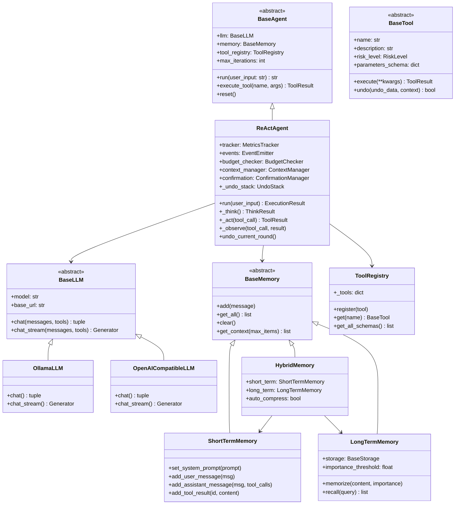
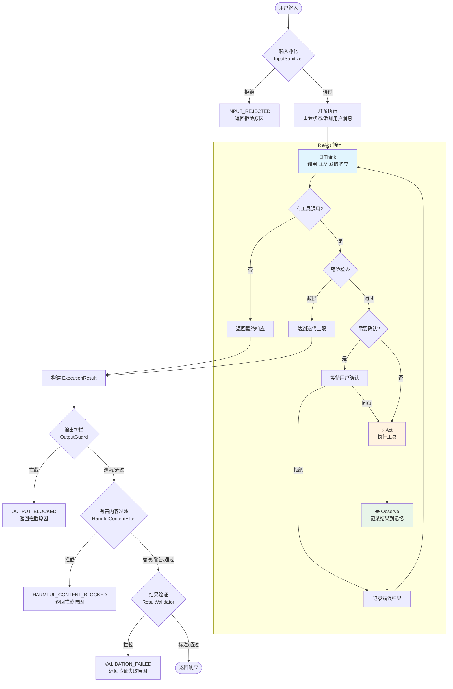
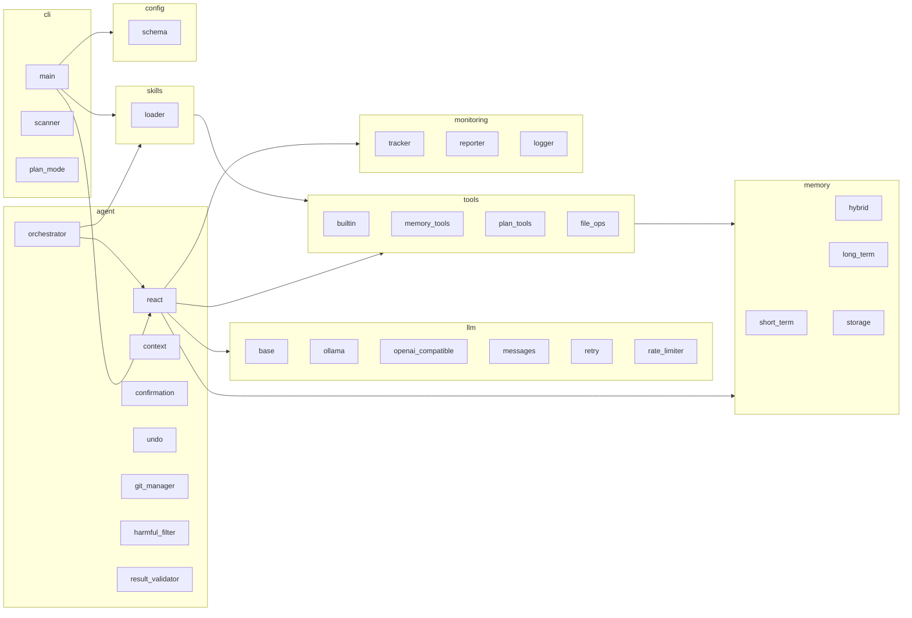

# NanoAgent 架构文档

本文档描述 NanoAgent 的系统架构，包括分层结构、核心组件和数据流。

## 1. 分层架构

```mermaid
graph TB
    subgraph CLI["CLI 层"]
        MAIN[main.py<br/>交互式入口]
        CONSOLE[console.py<br/>控制台工具]
        SCANNER[scanner.py<br/>项目扫描]
        PLAN[plan_mode.py<br/>计划模式]
    end

    subgraph Agent["Agent 层"]
        ORCH[AgentOrchestrator<br/>编排层]
        REACT[ReActAgent<br/>执行层]
        CTX[ContextManager<br/>上下文管理]
        CONFIRM[ConfirmationManager<br/>确认机制]
        UNDO[UndoStack<br/>撤销栈]
        GIT[GitManager<br/>Git集成]
        STALL[StallDetector<br/>停滞检测]
        CACHE[ToolResultCache<br/>多轮缓存]
        OFFLOAD[ToolOffloadManager<br/>结果卸载]
        AUDIT[EstimationAudit<br/>估算审计]
        SEMANTIC[SemanticCompressor<br/>语义压缩]
        RETRY[RetryHandler<br/>重试处理]
        RL[RateLimiter<br/>速率限制]
        CB[CircuitBreaker<br/>熔断降级]
        SAN[InputSanitizer<br/>输入净化]
        GUARD[OutputGuard<br/>输出护栏]
        HFILTER[HarmfulContentFilter<br/>有害内容过滤]
        RVALIDATOR[ResultValidator<br/>结果验证]
    end

    subgraph Core["核心组件"]
        LLM[LLM Client<br/>Ollama/OpenAI]
        MEM[Memory<br/>ShortTerm/Hybrid/LongTerm]
        TOOLS[ToolRegistry<br/>工具注册表]
        SKILLS[SkillRegistry<br/>技能注册表]
    end

    subgraph Storage["存储层"]
        FILE[FileStorage<br/>文件存储]
        SQLITE[SQLiteStorage<br/>数据库存储]
    end

    subgraph Monitoring["监控层"]
        TRACKER[MetricsTracker<br/>指标追踪]
        REPORTER[ReportGenerator<br/>报告生成]
    end

    MAIN --> ORCH
    MAIN --> SCANNER
    MAIN --> PLAN
    ORCH --> REACT
    ORCH --> SAN
    REACT --> CTX
    REACT --> CONFIRM
    REACT --> UNDO
    REACT --> GIT
    REACT --> STALL
    REACT --> CACHE
    REACT --> OFFLOAD
    REACT --> AUDIT
    REACT --> SEMANTIC
    REACT --> RL
    REACT --> RETRY
    REACT --> CB

    REACT --> LLM
    REACT --> MEM
    REACT --> TOOLS
    ORCH --> SKILLS

    MEM --> FILE
    MEM --> SQLITE

    REACT --> TRACKER
    TRACKER --> REPORTER
```



### 层级说明

| 层级 | 职责 | 主要组件 |
|------|------|----------|
| **CLI 层** | 用户交互、命令解析、会话管理 | `main.py`, `scanner.py`, `plan_mode.py` |
| **Agent 层** | 推理执行、上下文管理、撤销机制 | `ReActAgent`, `AgentOrchestrator`, `ContextManager`, `StallDetector`, `ToolResultCache`, `ToolOffloadManager`, `SemanticCompressor`, `RateLimiter`, `RetryHandler`, `CircuitBreaker`, `InputSanitizer`, `OutputGuard`, `HarmfulContentFilter`, `ResultValidator` |
| **核心组件** | LLM 调用、记忆管理、工具/技能注册 | `BaseLLM`, `BaseMemory`, `ToolRegistry`, `SkillRegistry` |
| **存储层** | 持久化存储 | `FileStorage`, `SQLiteStorage` |
| **监控层** | 执行追踪、报告生成 | `MetricsTracker`, `ReportGenerator` |

---

## 2. 核心类继承关系



### 关键数据结构

```python
@dataclass
class ToolResult:
    """工具执行结果"""
    success: bool
    output: str
    error: str | None = None
    metadata: dict | None = None
    undo_data: dict | None = None

@dataclass
class ExecutionResult:
    """Agent 执行结果"""
    response: str
    success: bool
    iterations: int
    tool_calls: list[dict]
    tokens_used: int
    session_id: str

@dataclass
class LLMCallMetrics:
    """LLM 调用指标（新增字段用于 Token 消耗分析）"""
    timestamp: datetime
    model: str
    prompt_tokens: int
    completion_tokens: int
    total_tokens: int
    latency_ms: float
    tool_calls_count: int
    # Token 分类相关
    input_messages: list[dict]    # 输入消息列表
    output_text: str              # 输出文本
    tool_calls: list[dict]        # 工具调用列表
    tools_schema: list[dict]      # 工具定义 schema
```

---

## 3. ReAct 循环数据流



### 循环阶段说明

| 阶段 | 方法 | 描述 |
|------|------|------|
| **净化** | `InputSanitizer.sanitize()` | 编排层硬门控，格式检查→注入检查→长度检查 |
| **护栏** | `OutputGuard.guard()` | 编排层后门控，敏感检测→遮蔽/拦截/警告 |
| **有害过滤** | `HarmfulContentFilter.filter()` | 编排层第二道防线，有害内容检测→拦截/替换/警告 |
| **结果验证** | `ResultValidator.validate()` | 编排层第三道防线，验证声明正确性→拦截/警告/标注 |
| **Think** | `_think()` | 调用 LLM，获取响应文本和工具调用 |
| **Act** | `_act()` | 执行工具，支持确认机制和撤销追踪 |
| **Observe** | `_observe()` | 将工具结果记录到记忆系统 |

---

## 4. 模块依赖关系



---

## 5. 代码量统计

| 模块 | 代码行数 | 文件数 | 主要文件 |
|------|---------|--------|----------|
| **cli** | 3,148 | 6 | `main.py` (2346行) - 交互式CLI入口 |
| **agent** | 2,143 | 13 | `react.py` (505行), `context.py` (440行), `git_manager.py` (295行) |
| **memory** | 1,996 | 13 | `sqlite_storage.py` (360行), `long_term.py` (345行), `hybrid.py` (292行) |
| **tools** | 1,972 | 11 | `memory_tools.py` (421行), `plan_tools.py` (355行), `file_ops.py` (318行) |
| **monitoring** | 819 | 5 | `tracker.py` (239行), `logger.py` (206行), `reporter.py` (205行) |
| **llm** | 694 | 5 | `openai_compatible.py` (192行), `ollama.py` (152行) |
| **config** | 339 | 3 | `schema.py` (188行), `loader.py` (150行) |
| **skills** | 334 | 3 | `loader.py` (189行), `base.py` (138行) |
| **utils** | 72 | 3 | `patterns.py` (43行) |

**总计**: 11,530 行 / 64 文件

---

## 6. 设计原则

### 用户干预控制

NanoAgent 采用"关键决策确认"模型，平衡用户控制与 LLM 自动化：

1. **审计透明**: 每次记忆操作后显示简要摘要
2. **一键撤销**: 用户可输入 `undo` 撤销最近操作
3. **无中断**: 正常流程持续进行，除非用户明确干预

```
[记忆] 存储用户名字: "王五" (importance: 0.8)
       输入 'undo' 撤销，或继续对话
```

### 抽象设计

- **BaseAgent/BaseLLM/BaseMemory/BaseTool**: 使用 ABC 定义抽象基类
- **Registry 模式**: `ToolRegistry` 和 `SkillRegistry` 集中管理扩展
- **策略模式**: 存储后端可插拔 (`FileStorage` / `SQLiteStorage`)

### LLM 调用三层稳定性机制

`BaseLLM.chat()` 内置三层调用链，从主动预防到被动恢复逐层保护：

```
chat()                          ← 入口方法
  │
  ├─ ① RateLimiter.acquire()    ← 主动预防：令牌桶限流
  │     令牌以 requests_per_minute/60 速率填充
  │     桶容量 = burst，满时丢弃新令牌
  │     桶空时阻塞等待，避免触发 API 429
  │
  ├─ ② with_retry(_chat_impl)   ← 被动恢复：指数退避重试
  │     429/500/502/503/504/网络错误 → 自动重试
  │     400/401/403/ValueError → 立即抛出不重试
  │     延迟 = min(base × 2^attempt + jitter, max_delay)
  │
  └─ ③ _chat_impl()             ← 实际 API 调用（子类实现）
        OllamaLLM / OpenAICompatibleLLM 各自实现
```

**设计原则**：
- **预防优于治疗**: RateLimiter 主动控制调用频率，减少 429 错误发生概率
- **优雅降级**: 即使限流失败触发 429，RetryHandler 仍可自动恢复
- **透明分层**: 子类只需实现 `_chat_impl()`，无需关心限流和重试逻辑

### 输入净化门控

`AgentOrchestrator` 在 ReAct 循环前执行 `InputSanitizer`，是编排层边界的硬门控：

```
用户输入
  │
  └─ InputSanitizer.sanitize()
       │
       ├─ ① 格式检查：null 字节 → 拒绝，控制字符 → 剥离
       │
       ├─ ② PII 脱敏（可选）：phone/id_card/email/api_key → 遮蔽替换
       │
       ├─ ③ 注入检查：正则匹配 injection_patterns → 拒绝
       │
       ├─ ④ 长度检查：超长 → 截断或拒绝
       │
       └─ 通过 → 进入 ReAct 循环
```

**设计原则**：
- **格式先于注入**: 先清理格式问题（null 字节、控制字符），再检测注入模式，防止通过编码绕过注入检测
- **PII 先于注入**: PII 脱敏在注入检查前执行，遮蔽后的文本参与注入检测，确保遮蔽后的 PII 不会被误判为注入
- **注入零容忍**: 注入模式匹配始终拒绝，不可配置为截断
- **长度可配置**: `length_action` 支持 `truncate`（默认，保留输入）或 `reject`（严格模式）

### 输出护栏门控

`AgentOrchestrator` 在 ReAct 循环后执行 `OutputGuard`，是编排层边界的后门控——与输入净化器形成对称保护：

```
Agent 响应
  │
  └─ OutputGuard.guard()
       │
       ├─ ① PII 检测：phone/id_card/email/api_key → 遮蔽（复用 PIIDesensitizer）
       │
       ├─ ② 输出敏感检测：password/private_key/connection_string → 遮蔽或拦截
       │
       ├─ ③ 自定义模式检测：custom_patterns → 遮蔽或拦截
       │
       └─ 结果 → mask(遮蔽) / block(拦截) / warn(警告)
```

### 有害内容过滤门控

`AgentOrchestrator` 在 OutputGuard 之后执行 `HarmfulContentFilter`，是编排层边界的第二道防线——OutputGuard 防止信息*泄露*，HarmfulContentFilter 防止*有害内容*触达用户：

```
OutputGuard 通过的响应
  │
  └─ HarmfulContentFilter.filter()
       │
       ├─ ① 多类别检测：violence/hate/dangerous/illegal + custom_patterns
       │
       ├─ ② 优先级规则：block > replace > warn
       │
       ├─ ③ block → 整个响应被拦截（HARMFUL_CONTENT_BLOCKED）
       │
       ├─ ④ replace → 有害片段替换为 replacement_text
       │
       └─ ⑤ warn → 添加 [Content Warning: ...] 前缀
```

**设计原则**：
- **输入输出+有害内容三层防护**: 输入净化器保护"进来"的数据，输出护栏保护"出去"的数据不含敏感信息泄露，有害内容过滤器保护"出去"的数据不含危险内容
- **默认关闭**: 有害内容的定义因使用场景而异，用户需显式启用并选择检测类别
- **灵活动作**: 每个类别可独立配置 block/warn/replace，允许用户对低风险内容（如 illegal）仅警告
- **工具输出也受保护**: HarmfulContentMiddleware（priority=99）在工具执行边界扫描输出，防止有害内容通过工具结果间接进入上下文

**设计原则**：
- **输入输出对称**: 输入净化器保护"进来"的数据，输出护栏保护"出去"的数据
- **PII 模式复用**: phone/id_card/email/api_key 的正则和遮蔽逻辑复用 `PIIDesensitizer`，避免重复
- **高危强制拦截**: `block_severity` 中的类型（默认 `private_key`）即使 action 为 mask 也会触发整响应拦截
- **三种动作**: mask（默认，遮蔽敏感数据）、block（拦截整个响应）、warn（允许但记录警告）

### 结果验证门控

`AgentOrchestrator` 在 HarmfulContentFilter 之后执行 `ResultValidator`，是编排层边界的第三道防线——OutputGuard 防止信息*泄露*，HarmfulContentFilter 防止*有害内容*触达用户，ResultValidator 防止*不正确的声明*误导用户：

```
HarmfulContentFilter 通过的响应
  │
  └─ ResultValidator.validate()
       │
       ├─ ① 声明提取：从 Agent 输出中提取可验证的声明
       │
       ├─ ② 逐项验证：file_exists/code_syntax/command_success/schema + custom_validators
       │
       ├─ ③ block（仅 high-severity）→ 整个响应被拦截（VALIDATION_FAILED）
       │
       ├─ ④ warn → 添加 [Validation Warning: ...] 前缀
       │
       └─ ⑤ annotate → 在响应中添加验证标注
```

**设计原则**：
- **四层防护管线**: 输入净化器保护"进来"的数据，输出护栏保护"出去"的数据不含敏感信息泄露，有害内容过滤器保护"出去"的数据不含危险内容，结果验证器保护"出去"的数据不含错误声明，schema 验证保护工具返回值结构正确性
- **默认关闭**: 结果验证会增加额外开销（文件系统检查、语法解析），用户需显式启用
- **block 限高严重度**: 仅 high-severity 失败（如声称创建了文件但不存在）触发拦截，medium/low 失败仅标注或警告
- **opt-in 渐进增强**: 从 annotate（默认）开始，用户可根据信任度调整到 warn 或 block

### 反馈闭环 (Feedback Loop)

v0.8.9 引入反馈闭环机制，连接观测层和执行层，实现偏差信号回流和自纠正循环：

```
#13 偏差信号回流:

  EstimationAudit.record()
       │
       ▼
  FeedbackLoop.check_deviation()
       │
       ├── deviation > threshold?
       │       │
       │       ▼ yes (冷却后)
       │   build_deviation_hint()
       │       │
       │       ▼
       │   memory.add_user_message("[System] {hint}")
       │       │
       │       ▼
       │   LLM 调整策略 → 偏差收敛
       │
       └── no → 继续

#14 自纠正循环:

  ResultValidator.validate()
       │
       ├── blocked?
       │       │
       │       ▼ yes (attempts remain)
       │   FeedbackLoop.build_correction_feedback()
       │       │
       │       ▼
       │   memory.add_user_message("[Self-Correction] ...")
       │       │
       │       ▼
       │   agent.run() 重试 → 验证通过 or 耗尽
       │
       └── no → 输出结果
```

**设计原则**：
- **偏差信号回流**: EstimationAudit 检测到高偏差时，注入提示引导 LLM 调整策略（与 StallDetector 模式一致）
- **冷却机制**: 每 N 次警告注入 1 次提示，防止上下文污染
- **自纠正循环**: ResultValidator 拦截时不直接返回失败，而是注入反馈重试
- **Token 累积**: 跨重试追踪总 token 消耗
- **终止原因**: 自纠正耗尽时返回 `SELF_CORRECTION_EXHAUSTED`

### 有害内容过滤门控

NanoAgent 提供精细化的 Token 消耗分析，支持三个层次的查看：

| 命令 | 说明 | 数据来源 |
|------|------|----------|
| `/stats` | 会话级累计统计 | `tracker.get_session_summary()` |
| `/usage` | 每次请求的 Token 明细 | `tracker.get_detailed_usage()` |
| `/context` | 下次请求的预算分析 | `tracker.get_base_ratio()` + `get_base_chars()` |

**Token 分类逻辑**：

```
LLM API 调用结构:
  messages: [...]     → prompt_tokens (部分)
  tools: [...]        → prompt_tokens (部分)
  
Token 分类:
  工具定义 = tools_schema 字符长度 × base_ratio
  系统提示 = system 消息字符长度 × base_ratio
  技能提示 = skill 相关消息 × base_ratio
  摘要     = [历史摘要] 消息 × base_ratio
  消息     = prompt_tokens - 上述固定部分 (减法保证准确)
  
base_ratio = 第一次迭代的 prompt_tokens / 总字符长度
```

**关键方法**：
- `tracker.get_detailed_usage()` - 返回每次迭代的详细 Token 分类
- `tracker.get_base_ratio()` - 返回基准比例（用于稳定估算）
- `tracker.get_base_chars()` - 返回基准字符长度（工具/系统/技能）

### 历史压缩机制

当对话历史过长时，`MessageCompressor` 会压缩旧消息：

1. 保留最近 N 条消息
2. 将旧消息压缩为 `[历史摘要]` 格式
3. 压缩后的摘要以 `role="system"` 添加到消息列表
4. `/usage` 的"摘要[*]"列专门显示这部分 Token
