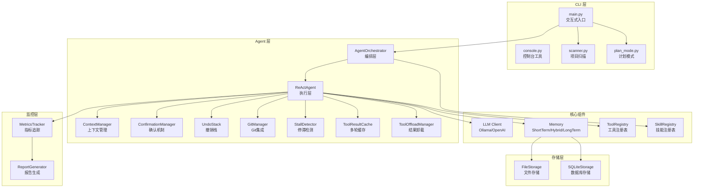
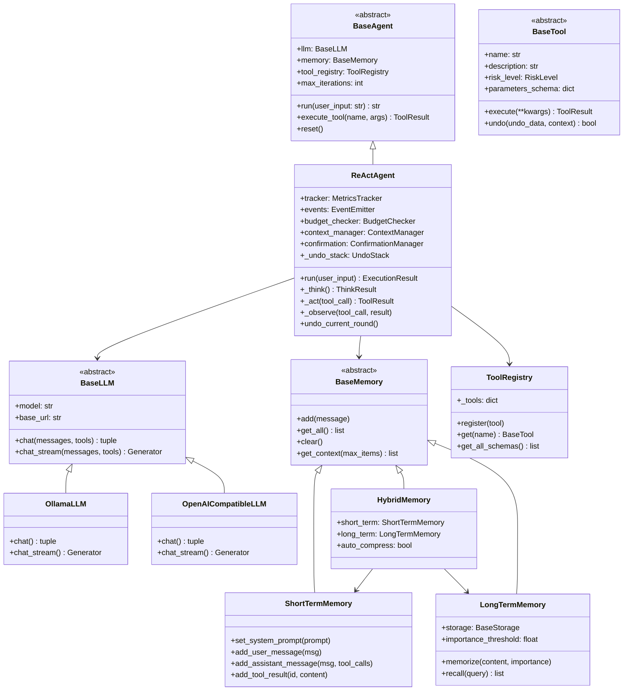
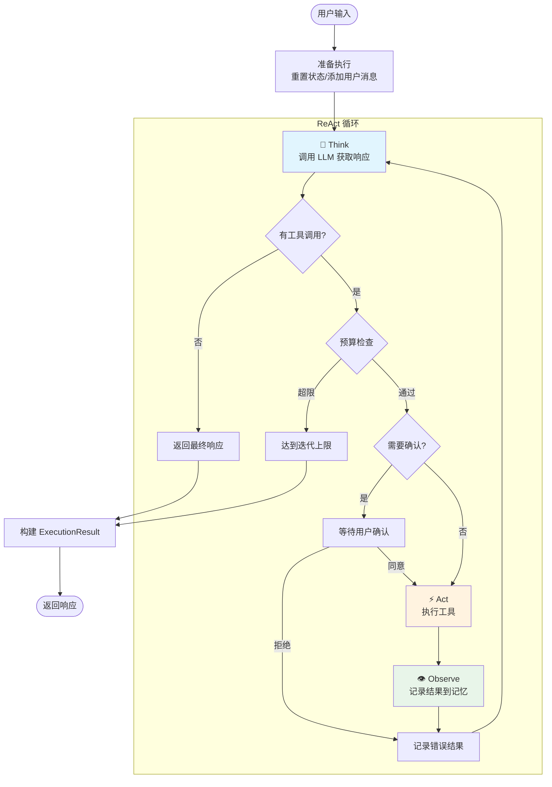
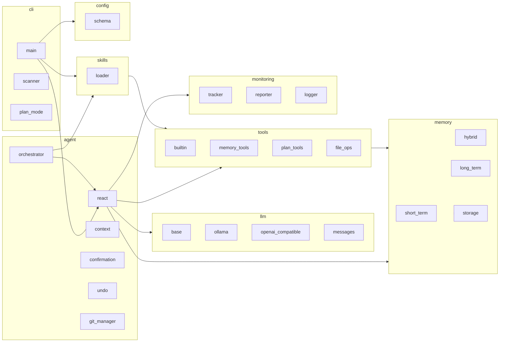

# NanoAgent 架构文档

本文档描述 NanoAgent 的系统架构，包括分层结构、核心组件和数据流。

## 1. 分层架构



### 层级说明

| 层级 | 职责 | 主要组件 |
|------|------|----------|
| **CLI 层** | 用户交互、命令解析、会话管理 | `main.py`, `scanner.py`, `plan_mode.py` |
| **Agent 层** | 推理执行、上下文管理、撤销机制 | `ReActAgent`, `AgentOrchestrator`, `ContextManager`, `StallDetector`, `ToolResultCache`, `ToolOffloadManager` |
| **核心组件** | LLM 调用、记忆管理、工具/技能注册 | `BaseLLM`, `BaseMemory`, `ToolRegistry`, `SkillRegistry` |
| **存储层** | 持久化存储 | `FileStorage`, `SQLiteStorage` |
| **监控层** | 执行追踪、报告生成 | `MetricsTracker`, `ReportGenerator` |

---

## 2. 核心类继承关系



### 关键数据结构

```python
@dataclass
class ToolResult:
    """工具执行结果"""
    success: bool
    output: str
    error: str | None = None
    metadata: dict | None = None
    undo_data: dict | None = None

@dataclass
class ExecutionResult:
    """Agent 执行结果"""
    response: str
    success: bool
    iterations: int
    tool_calls: list[dict]
    tokens_used: int
    session_id: str

@dataclass
class LLMCallMetrics:
    """LLM 调用指标（新增字段用于 Token 消耗分析）"""
    timestamp: datetime
    model: str
    prompt_tokens: int
    completion_tokens: int
    total_tokens: int
    latency_ms: float
    tool_calls_count: int
    # Token 分类相关
    input_messages: list[dict]    # 输入消息列表
    output_text: str              # 输出文本
    tool_calls: list[dict]        # 工具调用列表
    tools_schema: list[dict]      # 工具定义 schema
```

---

## 3. ReAct 循环数据流



### 循环阶段说明

| 阶段 | 方法 | 描述 |
|------|------|------|
| **Think** | `_think()` | 调用 LLM，获取响应文本和工具调用 |
| **Act** | `_act()` | 执行工具，支持确认机制和撤销追踪 |
| **Observe** | `_observe()` | 将工具结果记录到记忆系统 |

---

## 4. 模块依赖关系



---

## 5. 代码量统计

| 模块 | 代码行数 | 文件数 | 主要文件 |
|------|---------|--------|----------|
| **cli** | 3,148 | 6 | `main.py` (2346行) - 交互式CLI入口 |
| **agent** | 2,143 | 13 | `react.py` (505行), `context.py` (440行), `git_manager.py` (295行) |
| **memory** | 1,996 | 13 | `sqlite_storage.py` (360行), `long_term.py` (345行), `hybrid.py` (292行) |
| **tools** | 1,972 | 11 | `memory_tools.py` (421行), `plan_tools.py` (355行), `file_ops.py` (318行) |
| **monitoring** | 819 | 5 | `tracker.py` (239行), `logger.py` (206行), `reporter.py` (205行) |
| **llm** | 694 | 5 | `openai_compatible.py` (192行), `ollama.py` (152行) |
| **config** | 339 | 3 | `schema.py` (188行), `loader.py` (150行) |
| **skills** | 334 | 3 | `loader.py` (189行), `base.py` (138行) |
| **utils** | 72 | 3 | `patterns.py` (43行) |

**总计**: 11,530 行 / 64 文件

---

## 6. 设计原则

### 用户干预控制

NanoAgent 采用"关键决策确认"模型，平衡用户控制与 LLM 自动化：

1. **审计透明**: 每次记忆操作后显示简要摘要
2. **一键撤销**: 用户可输入 `undo` 撤销最近操作
3. **无中断**: 正常流程持续进行，除非用户明确干预

```
[记忆] 存储用户名字: "王五" (importance: 0.8)
       输入 'undo' 撤销，或继续对话
```

### 抽象设计

- **BaseAgent/BaseLLM/BaseMemory/BaseTool**: 使用 ABC 定义抽象基类
- **Registry 模式**: `ToolRegistry` 和 `SkillRegistry` 集中管理扩展
- **策略模式**: 存储后端可插拔 (`FileStorage` / `SQLiteStorage`)

### Token 消耗分析

NanoAgent 提供精细化的 Token 消耗分析，支持三个层次的查看：

| 命令 | 说明 | 数据来源 |
|------|------|----------|
| `/stats` | 会话级累计统计 | `tracker.get_session_summary()` |
| `/usage` | 每次请求的 Token 明细 | `tracker.get_detailed_usage()` |
| `/context` | 下次请求的预算分析 | `tracker.get_base_ratio()` + `get_base_chars()` |

**Token 分类逻辑**：

```
LLM API 调用结构:
  messages: [...]     → prompt_tokens (部分)
  tools: [...]        → prompt_tokens (部分)
  
Token 分类:
  工具定义 = tools_schema 字符长度 × base_ratio
  系统提示 = system 消息字符长度 × base_ratio
  技能提示 = skill 相关消息 × base_ratio
  摘要     = [历史摘要] 消息 × base_ratio
  消息     = prompt_tokens - 上述固定部分 (减法保证准确)
  
base_ratio = 第一次迭代的 prompt_tokens / 总字符长度
```

**关键方法**：
- `tracker.get_detailed_usage()` - 返回每次迭代的详细 Token 分类
- `tracker.get_base_ratio()` - 返回基准比例（用于稳定估算）
- `tracker.get_base_chars()` - 返回基准字符长度（工具/系统/技能）

### 历史压缩机制

当对话历史过长时，`MessageCompressor` 会压缩旧消息：

1. 保留最近 N 条消息
2. 将旧消息压缩为 `[历史摘要]` 格式
3. 压缩后的摘要以 `role="system"` 添加到消息列表
4. `/usage` 的"摘要[*]"列专门显示这部分 Token
